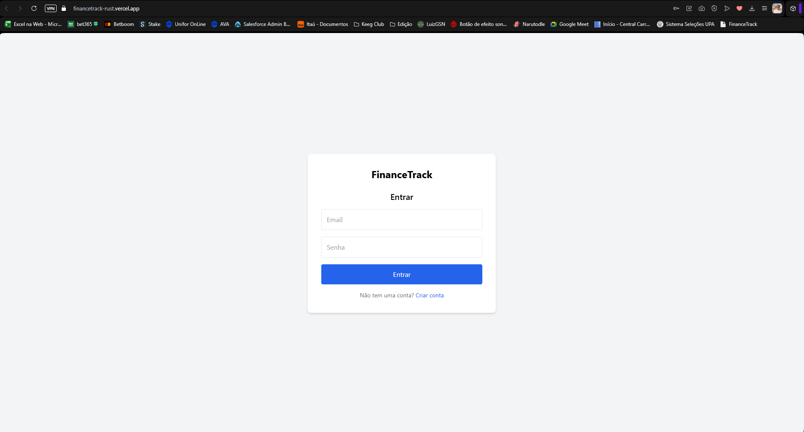
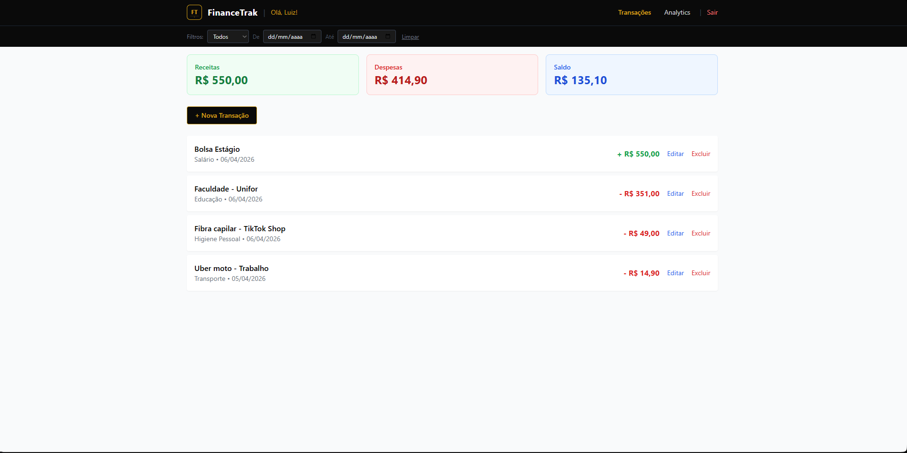
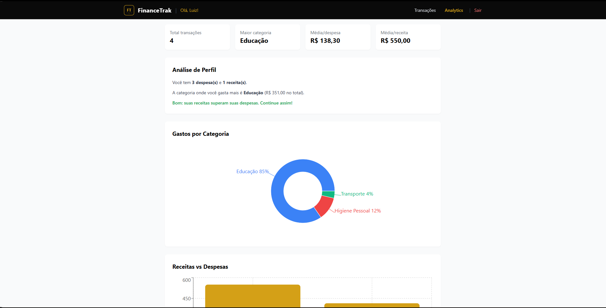

# FinanceTrak

> Aplicação fullstack de controle financeiro pessoal com dashboard, CRUD de transações e análise de gastos.


## Funcionalidades

- **Autenticação** — registro, login, JWT com hash bcrypt
- **CRUD de transações** — criar, editar, excluir receitas e despesas
- **Filtros por período** — intervalo de datas e tipo (receita/despesa)
- **Dashboard** — resumo com receitas, despesas e saldo em tempo real
- **Analytics** — gráficos de pizza (categoria), barras (receitas vs despesas) e linhas (evolução mensal)
- **Análise de perfil** — insights automáticos sobre seus gastos

## Demonstração

| Login & Dashboard | Analytics |
|---|---|
|  |  |

## Tecnologias

| Frontend | Backend |
|---|---|
| React 19 | Node.js + Express |
| Vite 6 | PostgreSQL (pg) |
| Tailwind CSS | JWT + bcrypt |
| Recharts | Helmet, rate-limit |

## Requisitos

- Node.js >= 20
- PostgreSQL >= 17
- npm

## Instalação

### 1. Clone o repositório

```bash
git clone https://github.com/LuizGSN/FinanceTrack.git
cd FinanceTrack
```

### 2. Configure o banco de dados

```bash
# Execute no PostgreSQL
createdb financetrack
```

Ou use Docker:

```bash
docker compose up -d postgres
```

### 3. Configure o backend

```bash
cd backend
cp .env.example .env
# Edite o .env com sua DATABASE_URL e JWT_SECRET
npm ci
node src/server.js
```

### 4. Configure o frontend

```bash
cd frontend
npm ci
npm run dev
```

O app estará disponível em `http://localhost:5173`.

## Rodar com Docker

```bash
docker compose up --build
```

Tudo sobe em um comando: PostgreSQL, backend e frontend. Acesse `http://localhost`.

## Estrutura do Projeto

```
FinanceTrack/
├── docker-compose.yml
├── backend/
│   ├── src/
│   │   ├── server.js          # Entry point, middleware, rotas
│   │   ├── database/db.js     # Pool PostgreSQL, wrapper prepare
│   │   ├── middleware/auth.js  # JWT middleware
│   │   └── routes/
│   │       ├── auth.js         # Login, registro, me
│   │       └── transactions.js # CRUD de transações
│   ├── .env
│   ├── .env.example
│   └── Dockerfile
└── frontend/
    ├── src/
    │   ├── App.jsx             # Router por estado
    │   ├── api.js              # Fetch wrappers
    │   ├── config.js           # Variáveis de ambiente
    │   ├── pages/
    │   │   ├── LoginPage.jsx
    │   │   ├── Dashboard.jsx
    │   │   └── AnalyticsPage.jsx
    │   └── components/
    │       ├── Header.jsx
    │       ├── Logo.jsx
    │       ├── Summary.jsx
    │       ├── TransactionList.jsx
    │       └── TransactionForm.jsx
    ├── Dockerfile
    └── nginx.conf
```

## API Endpoints

| Método | Path | Auth | Descrição |
|---|---|---|---|
| POST | `/auth/register` | Não | Criar conta |
| POST | `/auth/login` | Não | Login |
| GET | `/auth/me` | Sim | Dados do usuário |
| GET | `/transactions` | Sim | Listar transações (filtros: `type`, `date_from`, `date_to`) |
| POST | `/transactions` | Sim | Criar transação |
| PUT | `/transactions/:id` | Sim | Atualizar transação |
| DELETE | `/transactions/:id` | Sim | Deletar transação |

## Segurança

- Senhas com **bcrypt 12 rounds**
- **Helmet** para headers HTTP seguros
- **Rate limiting** em rotas de auth
- **CORS** restrito
- Validação de todos os inputs (email, senha, valores, datas)
- SQL injection protegido por **prepared statements** do `pg`

## Deploy

### Render (Backend)

1. Conecte o repo no [Render](https://render.com)
2. Crie um serviço Web apontando para `backend/`
3. Configure as variáveis de ambiente:
   - `DATABASE_URL` — string do Neon/Supabase/PostgreSQL
   - `JWT_SECRET` — chave aleatória forte
   - `ALLOWED_ORIGINS` — URL do frontend (Vercel/Netlify)
   - `NODE_ENV=production`

### Vercel (Frontend)

1. Conecte o repo na [Vercel](https://vercel.com)
2. Aponte para o diretório `frontend/`
3. Configure a variável `VITE_API_BASE_URL` com a URL do backend no Render
4. Deploy automático no push

---

Feito com por [Luiz Gonzaga](https://github.com/<LuizGSN>)
